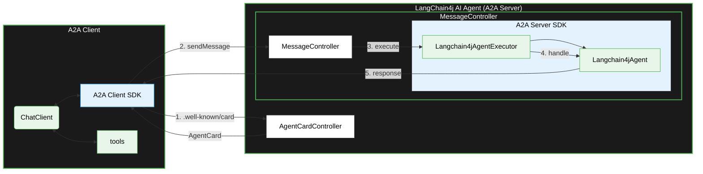

> **Engineering Blog · April 2026**  
> 📦 Spring Boot 4 · LangChain4j · SpringAI A2A Server\
> 🧠 Ollama / Qwen3\
> 🔗 **[A2A Protocol 1.0](https://a2a-protocol.org/latest/)** 

## Table of Contents
- [Spring A2A Server AutoConfiguration](#spring-a2a-server-autoconfiguration)
- [LangChain4j Agent](#langchain4j-agent)
- [LangChain4j Agent Executor and Handler](#langchain4j-agent-executor-and-handler)

---

## Overview



## Spring A2A Server AutoConfiguration

 [Spring A2A Server AutoConfiguration](https://github.com/spring-ai-community/spring-ai-a2a/tree/main/spring-ai-a2a-server-autoconfigure)
 allows to declare [AgentCard](https://a2a-protocol.org/latest/specification/#441-agentcard), [AgentExecutor](https://github.com/a2aproject/a2a-java/blob/main/server-common/src/main/java/org/a2aproject/sdk/server/agentexecution/AgentExecutor.java) for [LangChain4j](https://docs.langchain4j.dev/) Agents.However the **DefaultAgentExecutor** of Spring AI A2A Server implementation by design expects **ChatClient** and **ChatClientExecutorHandler** which are specific to Spring's way of managing the **[A2A Server](https://a2a-protocol.org/latest/)** implementation.


## LangChain4j Agent 

Lets build a simple **LangChain4j** Agent using [AgenticServices](https://docs.langchain4j.dev/tutorials/agents/) which allows to build agents using **Builder** pattern. **GeneralQAAgent** is a simple agent capable of managing **Q&A** queries from the customer backed by a language model.

```code
GeneralQAAgent generalQAAgent = AgenticServices
                .agentBuilder(GeneralQAAgent.class)
                .outputKey("answer")
                .chatModel(chatModel)
                .build();
```

To make this **GeneralQAAgent** to participate in **[A2A](https://a2a-protocol.org/latest/)** protocol, we can define custom **Langchain4jAgentExecutor** and **Langchain4jAgentExecutorHandler** 

## LangChain4j Agent Executor and Handler

Lets define two **Functional Interface** for handling the execution request from the **[AgentExecutor](https://github.com/a2aproject/a2a-java/blob/main/server-common/src/main/java/org/a2aproject/sdk/server/agentexecution/AgentExecutor.java)**

✨ One which accepts **ChatModel** and **RequestContext**\
✨ One which accepts **Agent** and **RequestContext**

**Langchain4jChatModelExecutorHandler**
```java
@FunctionalInterface
public interface Langchain4jChatModelExecutorHandler {
    String execute(ChatModel chatModel,RequestContext requestContext);
}
```
**Langchain4jAgentExecutorHandler**
```java
@FunctionalInterface
public interface Langchain4jAgentExecutorHandler {
    String execute(Agent langchain4jAgent, RequestContext requestContext);
}
```

Lets define two custom **[AgentExecutor](https://github.com/a2aproject/a2a-java/blob/main/server-common/src/main/java/org/a2aproject/sdk/server/agentexecution/AgentExecutor.java)** for handling the **[A2A](https://a2a-protocol.org/latest/)** client request 

✨ **Langchain4jAgentExecutor**\
✨ **Langchain4jChatModelExecutor**

Now these **Executors** can be used to integrate with **GeneralQAAgent** to make it particiapate in **[A2A](https://a2a-protocol.org/latest/)** protocol negotiation. 


## Final Outcome

Using **Spring AI A2A Server** , we are successfully able to expose any Agent/AI Service applications built using **Langchain4j** as A2A Server 